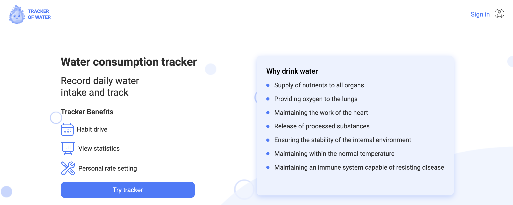

###Water Tracker Backend

Це репозиторій бекенду для веб-додатка, призначеного для ведення обліку кількості випитої води користувачем протягом дня, місяця та року.

##Технології:

У даному проекті використані такі технології та бібліотеки:

Node.js: Забезпечує виконання JavaScript на сервері.
Mongoose: Один із найпопулярніших ODM (Object Data Modeling) для MongoDB та Node.js, спрощує взаємодію з базою даних.
Joi: Бібліотека для валідації та форматування об'єктів у JavaScript.
Express Ul: Фреймворк для створення веб-додатків та API на Node.js.
Multer: Middleware для обробки файлових завантажень.
Swagger Ul: Інструмент для документації та тестування API.
Gravatar: Забезпечує можливість отримання аватару за email-адресою.
NodeMailer: Бібліотека для відправки електронних листів через Node.js.
Cloudinary: Сервіс для зберігання та опрацювання мультимедійного вмісту у хмарі.

##API Документація

Документація API доступна за посиланням Swagger Documentation [Swagger Documentation](https://backend-water-tracker.onrender.com/api-docs/#/).

##Завдання

Проект створений для полегшення ведення обліку випитої води. Вам також доступні інші можливості, такі як завантаження аватару, налаштування особистого кабінету та інші.

###Water Tracker Backend

This is the backend repository for a web application designed to track the amount of water consumed by users on a daily, monthly, and yearly basis.

##Technologies:

The project utilizes the following technologies and libraries:

Node.js: Enables the execution of JavaScript on the server.
Mongoose: One of the most popular Object Data Modeling (ODM) libraries for MongoDB and Node.js, simplifying database interactions.
Joi: A library for validation and object schema formatting in JavaScript.
Express Ul: A framework for building web applications and APIs on Node.js.
Multer: Middleware for handling file uploads.
Swagger Ul: A tool for documenting and testing APIs.
Gravatar: Provides the ability to fetch avatars based on email addresses.
NodeMailer: A library for sending emails using Node.js.
Cloudinary: A service for storing and processing multimedia content in the cloud.

##API Documentation

API documentation is available at Swagger Documentation [Swagger Documentation](https://backend-water-tracker.onrender.com/api-docs/#/) when the server is running.

##Tasks

The project is created to facilitate tracking of water consumption. You also have additional features such as uploading avatars, personal account settings, and more.
